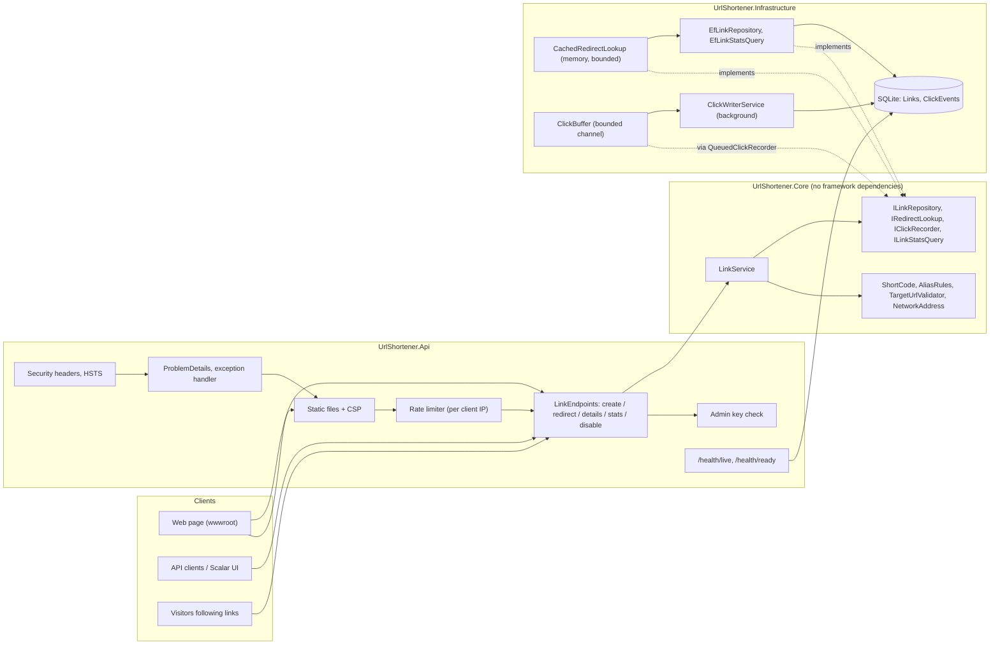
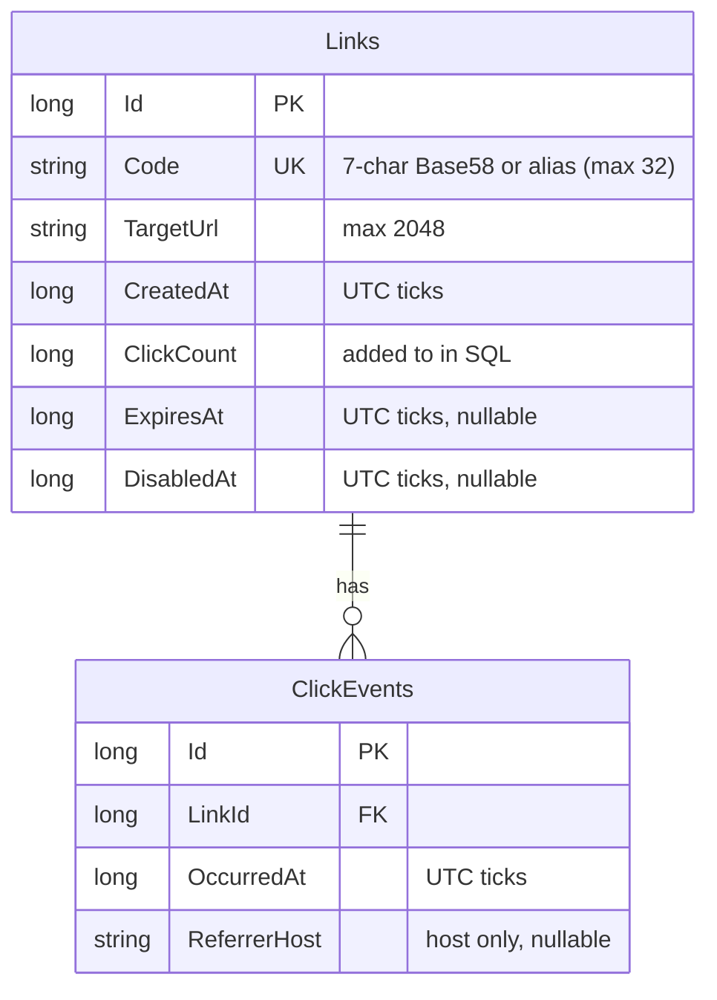
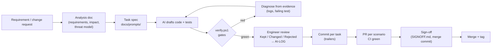

# Architecture

A URL shortener on ASP.NET Core (.NET 10): create short links, redirect visitors, record clicks for analytics, and
resist abuse. This page covers the components, tools, how the work was executed, the control flow of the main
requests, and the key decisions.

## 1. Components

| Project | Responsibility | Depends on |
|---|---|---|
| `UrlShortener.Core` | Domain rules and use cases: codes, aliases, URL rules, link status, `LinkService`, the interfaces it needs | nothing (no packages) |
| `UrlShortener.Infrastructure` | EF Core + SQLite, migrations, repository and stats query, redirect cache, click buffer and background writer | Core |
| `UrlShortener.Api` | HTTP: endpoints, ProblemDetails, rate limits, admin key, security headers, OpenAPI/Scalar, web page, health | Core, Infrastructure |

The dependency rule (Core depends on nothing) keeps the business rules testable in isolation: 132 unit tests run in
under 0.1 seconds.

## 2. Data model

Indexes: unique `Links(Code)`; `ClickEvents(LinkId, OccurredAt)`. Dates are stored as UTC ticks so SQLite can sort
and group them. No IP addresses are stored.

Three additive migrations: `InitialCreate` (v0.1), `AddClickEvents` (v0.2), `AddExpiryAndDisable` (v0.3). An upgrade
test proves a v0.1 database reaches the latest schema with its data intact.

## 3. Control flow of the main requests

**Create** (`POST /api/links`)
1. Rate limit `create` (10/min per IP) → 429 if exceeded.
2. Validate the target: shape, then abuse rules (no credentials, no private/local addresses in any notation, no
   internal names, no self-links, denylist) → 400 with the reason.
3. Validate the optional expiry (future, ≤ 365 days) and optional alias (format, reserved, impersonation) → 400.
4. Insert. The **unique index** decides whether the code is free: a random code is retried up to 5 times (then 503);
   a taken alias returns 409.
5. 201 + `Location` + the link.

**Redirect** (`GET /{code}`): the hot path
1. Rate limit `redirect` (300/min per IP).
2. Reject malformed codes without touching the database → 404.
3. Look up `(link id, target, expiry, disabled)` through the **memory cache** (5 min, bounded; unknown codes never cached).
4. Expired or disabled → **410 Gone**, no click recorded.
5. Queue a `ClickEvent` (time, referrer host) in the **bounded buffer**, without waiting → **302** to the target.
6. In the background, `ClickWriterService` inserts events in batches and runs `ClickCount = ClickCount + n` in the
   same transaction. Counts are eventually consistent; nothing is read, changed in memory and written back.

**Stats** (`GET /api/links/{code}/stats`): per UTC day for the last 30 days (grouped in SQL) and the top 5 referrer hosts.

**Disable** (`DELETE /api/links/{code}`): `X-Admin-Key` compared in constant time with the configured key (endpoint
off when none) → atomic update → cache entry evicted → 204.

## 4. Tools
| Area | Tool |
|---|---|
| Runtime | .NET 10, ASP.NET Core Minimal APIs |
| Data | EF Core 10 + SQLite, `dotnet-ef` (pinned local tool) |
| API docs | OpenAPI (built into .NET 10) + Scalar UI |
| Tests | xUnit, `WebApplicationFactory`, in-memory SQLite, coverlet |
| Quality gates | `scripts/verify.ps1`: warnings as errors + .NET analyzers, `dotnet format`, tests with coverage, vulnerable-package scan |
| CI | GitHub Actions: the same script + gitleaks secret scan on every push and PR |
| Container | Multi-stage Dockerfile, non-root runtime image |
| AI assistance | Claude Code, under the rules in [CLAUDE.md](../CLAUDE.md) and [AI-USAGE-POLICY.md](AI-USAGE-POLICY.md) |

## 5. Execution approach (how the work was done)

- **Three scenarios, three branches, three tags:** greenfield `v0.1.0`, brownfield `v0.2.0`, ambiguous `v0.3.0`.
- Every scenario starts with analysis **before code** (requirements, impact analysis, threat model).
- Every non-trivial task starts from a written spec; its Iterations table records what the AI returned and what I did.
- High-impact changes (schema, API contract, security, dependencies, CI) need my sign-off ([SIGNOFF.md](SIGNOFF.md)).

## 6. Key decisions
| Decision | Record |
|---|---|
| SQLite with EF Core behind a repository interface | [ADR-0001](adr/0001-sqlite-with-ef-core.md) |
| Random 7-character Base58 codes, uniqueness by unique index + retry | [ADR-0002](adr/0002-short-code-generation.md) |
| Clicks as events through a bounded buffer and one background writer | [ADR-0003](adr/0003-async-click-recording.md) |
| Abuse controls the app can enforce itself, visitors first | [ADR-0004](adr/0004-abuse-controls.md) |
| 302 (not 301), so every click reaches us | [REQUIREMENTS.md](REQUIREMENTS.md) |
| Static files before routing (a one-segment catch-all would claim `/app.js`) | [GF-05 spec](prompts/GF-05-static-page.md) |

## 7. Scaling path (not built)
Single node today. To scale out: PostgreSQL (a contained change behind the repository), migrations as a deploy step,
a durable queue for clicks (Service Bus / Kafka) instead of the in-memory buffer, Redis for the redirect cache and
rate limits, forwarded headers from trusted proxies, and real authentication instead of the admin key.
