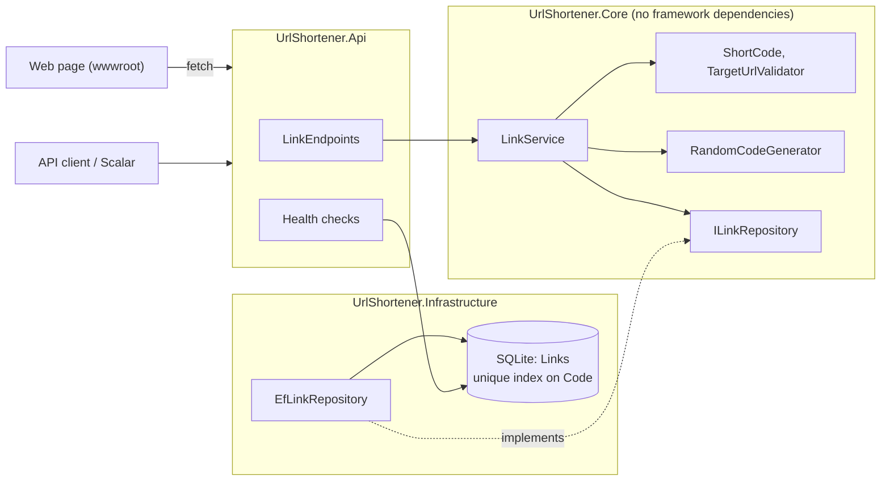
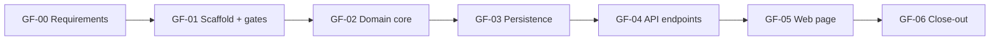

# Scenario 1: Greenfield, the core service (v0.1.0)

Build a working URL shortener from an empty repo: create a short link, follow it, see its details, from an API and
a simple web page, with quality gates in place from the first commit.

## 1. Requirement
From [REQUIREMENTS.md](../REQUIREMENTS.md): **FR-1** create, **FR-2** redirect, **FR-3** details, **FR-4** web page,
**FR-6** reject invalid URLs (basic rules), and **NFR-2, NFR-3, NFR-5, NFR-6** (reliability, security,
maintainability, runs with no external services).

## 2. Ambiguities and assumptions
The full table is in [REQUIREMENTS.md](../REQUIREMENTS.md#ambiguities-and-my-assumptions). The ones that shaped v0.1:
- **302, not 301**, so every click reaches us (a 301 is cached by browsers).
- **A new code per request**, even for the same URL.
- **No accounts.** Anyone can create links and read details (the top follow-up).
- **Single node, SQLite**, behind a repository interface so the database can change later.

## 3. Design

**Create** (`POST /api/links`): validate URL → generate a 7-character Base58 code → insert. If the unique index
rejects the code, retry with a new one (up to 5 times, then 503).

**Redirect** (`GET /{code}`): reject malformed codes without touching the database → look up → increment the click
count → **302** to the target. The click count uses a simple read-modify-write (see Known limitations).

Key decisions are recorded as ADRs:
[0001 SQLite with EF Core](../adr/0001-sqlite-with-ef-core.md) ·
[0002 Short code generation](../adr/0002-short-code-generation.md).

## 4. Task decomposition

| Task | What | Requirements | Spec | Sign-off |
|---|---|---|---|---|
| GF-00 | Requirements, ambiguities, delivery plan | all | none (docs) | none |
| GF-01 | Solution, shared build rules, `verify.ps1`, CI + secret scan | NFR-5, NFR-6 | [GF-01](../prompts/GF-01-solution-scaffold.md) | #1 CI, packages |
| GF-02 | Code format (Base58), secure generator, URL validator, `LinkService` | FR-1, FR-2, FR-6 | [GF-02](../prompts/GF-02-domain-core.md) | none |
| GF-03 | EF Core + SQLite, unique index, migration, readiness check | FR-1–3, NFR-2 | [GF-03](../prompts/GF-03-persistence.md) | #3 schema, packages |
| GF-04 | HTTP endpoints, ProblemDetails, OpenAPI + Scalar, click count | FR-1–3, FR-6 | [GF-04](../prompts/GF-04-api-endpoints.md) | #4 API contract, packages |
| GF-05 | Web page, Content-Security-Policy | FR-4, NFR-3 | [GF-05](../prompts/GF-05-static-page.md) | #5 security |
| GF-06 | This write-up, ADRs, sample requests, merge, tag | NFR-5 | none (docs) | none |

Sign-off #2 (default branch `main`, CI on feature branches) was an infrastructure change made between GF-02 and GF-03.

## 5. Execution: what happened
Each spec's **Iterations** table has the detail. The moments that changed the outcome:

| Task | What happened | What I did |
|---|---|---|
| GF-01 | The AI claimed unused-`using` checks work without extra setup; the build failed | Fixed the setting; logged as an AI mistake caught by a gate |
| GF-01 | The AI suggested keeping template package versions | Overruled: upgraded to latest where nothing broke; tried xUnit v3 and rolled it back (a test-platform migration, not an upgrade) |
| GF-02 | The AI proposed Base62 | Chose Base58 after comparing hex, Base64Url, counters, hashing and modulo bias |
| GF-03 | The "forgotten migration" test did not fail on a max-length change | Generated a probe migration: empty, because SQLite does not enforce length. A table rename did fail the test |
| GF-04 | 5 tests failed | 3 were a bug in the test helper (body read twice); 2 were real: malformed JSON gave 500 in Development. Fixed so it's 400 everywhere |
| GF-05 | `/app.js` could be claimed by the `/{code}` route | Proved it with failing tests first, then served static files before routing; a test locks the order |
| GF-05 | First draft of one test was unreadable | Rejected and rewritten |

AI usage for this scenario: [AI-LOG](../AI-LOG.md) rows #1–#9.

## 6. Validation

| Check | Result |
|---|---|
| `scripts/verify.ps1` (restore, build with warnings as errors + analyzers, format, tests with coverage, vulnerable packages) | Green locally and in CI on every pushed commit |
| Secret scan (gitleaks, full history) | Green |
| Unit tests | 47: code format and generator, URL validator, `LinkService` (create, retry, give-up, resolve, visit) |
| Integration tests | 32: repository on real in-memory SQLite, migrations (incl. "no pending model changes"), all HTTP endpoints, ProblemDetails, Host-header protection, route precedence, web page + CSP |
| Negative checks | Planted unused variable fails the build; table rename without migration fails the migration test; naive static-file order fails the page tests |
| Manual | App run in Production mode (create 201, redirect 302, count 0 → 1, bad URL 400, malformed JSON 400, unknown 404, `/scalar` 200); page checked in a browser |

## 7. Known limitations (accepted for v0.1)
| Limitation | Why accepted | Addressed in |
|---|---|---|
| **Click count is read-modify-write**: concurrent redirects can overwrite each other's count | Simplest correct behaviour for one visitor at a time | Brownfield scenario (CR-002) |
| Basic URL rules only (no private-IP or credential checks) | Abuse handling is its own scenario | AB-02 |
| No rate limiting, alias or expiry | Same | AB-03, AB-03b, AB-04 |
| No authentication | Out of scope for the prototype | Documented follow-up |
| SQLite single writer; migrate on startup | Zero setup for one node | ADR-0001 |
| OpenAPI/Scalar open to everyone | Lets reviewers try the API | Restrict in production |
| No automated JavaScript tests | Page logic is tiny; checked manually | Documented |

## 8. Sign-offs
[SIGNOFF.md](../SIGNOFF.md) #1 (CI and test packages), #3 (schema, EF Core packages), #4 (API contract, OpenAPI
packages), #5 (Content-Security-Policy).
