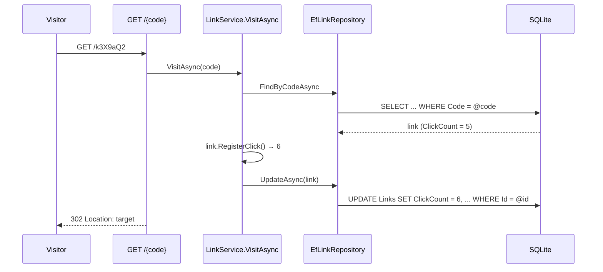
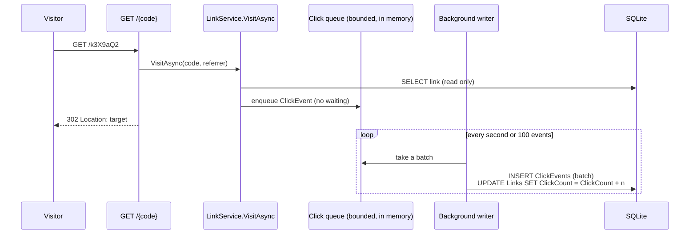
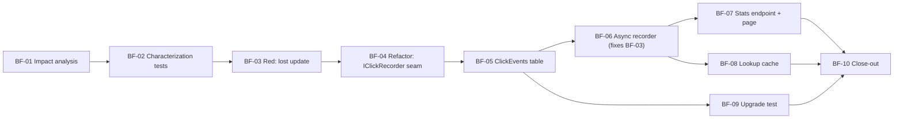

# Scenario 2: Brownfield, click analytics (v0.2.0)

A change request against the existing system. I treat **v0.1.0 as the existing codebase**: the code was written
earlier in this repo under the greenfield scenario, then frozen and tagged. The analysis below is done on that tag,
before any brownfield code is written.

## 1. Change request (CR-002)
> "Show clicks per day and the top referring sites for each link. The redirect must stay fast: it's our hottest endpoint."

Requirements touched: **FR-5** (analytics, new), **FR-4** (web page shows stats), **NFR-1** (redirect performance),
**NFR-2** (correct under concurrency), **NFR-4** (privacy).

## 2. Ambiguities and assumptions
| Question | Assumption | Why |
|---|---|---|
| "Per day" in which time zone? | **UTC** days | One unambiguous answer for every viewer; local time is a display concern |
| How far back? | Last **30 days** in the stats response; all events kept | Enough for a link's useful life; retention policy is a product decision (open question) |
| How many "top" referrers? | **Top 5** by clicks | Fits on the page; more is noise |
| What is a "referring site"? | The **host** of the `Referer` header (`news.example.com`); none → `(direct)` | The full referrer URL can contain tokens or personal data (NFR-4) |
| Do bots count? | Yes, every redirect counts | Bot filtering needs a product decision and a reliable signal; noted as a limitation |
| Must stats be real-time? | **Eventually consistent, within seconds** | Required to keep the database write off the redirect path (see 4) |
| Store IP addresses? | **No** | Not needed for these analytics (NFR-4) |

## 3. Impact analysis of v0.1.0

### 3.1 How a redirect works today


### 3.2 Problems found while reading this path
1. **Lost updates (a correctness bug).** `VisitAsync` reads the count, adds 1 in memory and writes the new value back.
   Two concurrent redirects can both read 5 and both write 6, so one click disappears. v0.1 documented the
   read-modify-write as a simplification; reading the hot path for this CR makes the risk concrete. I will
   **prove it with a failing test before changing anything** (BF-03).
2. **The visitor waits for a database write** on every redirect, which goes against "the redirect must stay fast".
3. **A single counter can't answer the CR:** "clicks on Tuesday" or "from which site" need one record per click.

### 3.3 Impacted modules
| Area | File(s) | Change | Risk |
|---|---|---|---|
| Hot path | `Core/Links/LinkService.cs` (`VisitAsync`), `Api/Endpoints/LinkEndpoints.cs` (redirect) | Stop writing synchronously; hand the click to a recorder | Latency regression; lost clicks |
| Domain | `Core/Links/ClickEvent.cs`, `Core/Links/IClickRecorder.cs` (new) | One event per click: link, time (UTC), referrer host | Low |
| Data | `Infrastructure/Persistence/*`, **new migration** | New `ClickEvents` table, index `(LinkId, OccurredAt)` | Schema change (sign-off) |
| Background | `Infrastructure/Clicks/*` (new) | Bounded in-memory queue + background writer in batches | Events lost on crash; queue full |
| Existing field | `Links.ClickCount` | Kept for backward compatibility, now updated **atomically** (`ClickCount = ClickCount + n`) by the writer | Count lags by seconds |
| API contract | `GET /api/links/{code}/stats` (new) | Additive, nothing existing changes shape | Public contract (sign-off) |
| Behaviour change | `GET /api/links/{code}` `clickCount` | Becomes **eventually consistent** (seconds), not immediate | The GF-04 test that asserts the count right after a redirect must change to wait for it, deliberately and documented |
| Web page | `wwwroot/*` | Stats panel | Low |
| Performance | lookup path | Optional in-memory cache for code → link (BF-08) | Stale entries once links can be disabled (AB-04) |

### 3.4 Target design

- **No read-modify-write anywhere:** events are inserted, and counts are added inside the database.
- **The redirect never waits for a write.**
- **Trade-offs:** events still in the queue are lost if the process crashes (acceptable for analytics; the
  queue is flushed on normal shutdown). If the queue is full (a burst beyond what the writer keeps up with), new
  events are dropped and a warning is logged, never blocking the redirect.

### 3.5 Migration and rollback
- The migration is **additive only** (a new table and index). Nothing is dropped or renamed.
- **Rollback:** redeploy v0.1.0. It ignores the extra table, and `ClickCount` is still valid.
- An **upgrade test** proves a v0.1 database with existing links and counts migrates with data intact (BF-09).

## 4. Task decomposition



| Task | What | Requirements | Spec |
|---|---|---|---|
| BF-01 | This impact analysis (no code) | FR-5, NFR-1, NFR-4 | none (docs) |
| BF-02 | Characterization tests: pin today's redirect and count behaviour | FR-2, FR-3 | none |
| BF-03 | Failing test: concurrent redirects must all be counted | NFR-2 | none |
| BF-04 | Pure refactor: extract `IClickRecorder` with today's behaviour | NFR-5 | none |
| BF-05 | `ClickEvent` + `ClickEvents` table, additive migration | FR-5 | none |
| BF-06 | Bounded queue + background batch writer, atomic count update | FR-5, NFR-1, NFR-2 | [BF-06](../prompts/BF-06-async-click-recorder.md) |
| BF-07 | `GET /api/links/{code}/stats` + stats panel on the page | FR-5, FR-4, NFR-4 | [BF-07](../prompts/BF-07-stats-endpoint.md) |
| BF-08 | In-memory cache for code → link lookups | NFR-1 | none |
| BF-09 | Upgrade test: v0.1 database → v0.2 | NFR-2 | none |
| BF-10 | Results, ADR-0003, PR, tag `v0.2.0` | NFR-5 | none |

**Process note:** to fit the deadline, this scenario is reviewed **once, at the end**, instead of after every task.
Each task is still its own commit, and the high-impact changes (the migration in BF-05 and the stats contract in
BF-07) get their sign-off rows when I approve the scenario, recorded in the merge commit.

## 5. Execution

### BF-02: characterization tests (green on v0.1)
Pinned: exact 302 target, each sequential redirect counted, 404 for unknown/malformed codes with nothing counted,
new links at zero. Counts are asserted on the outcome (poll until reached), not the timing, so these tests stay
valid when counting becomes eventually consistent.

### BF-03: the bug, proven before any fix
`ConcurrentClickTests`: create a link, fire **50 redirects at the same time**, expect 50 clicks.

```
Assert.Equal() Failure: Values differ
Expected: 50
Actual:   1
```
Same result in 3 out of 3 runs. All 50 redirects returned 302, but the count is **1**: every request read
`ClickCount = 0` before any of them wrote, and each wrote back `1`. This is the lost update from 3.2, in its worst form.
The test is committed **failing on purpose**, so the history shows red before green.

### BF-04: refactor with no behaviour change
"Count the click" moved behind `IClickRecorder`; the only implementation was the v0.1 logic, unchanged. Result:
everything green **except BF-03, still red**, which is what a pure refactor should look like.

### BF-05: schema
`ClickEvents` table, foreign key to `Links`, index `(LinkId, OccurredAt)`. The migration only adds; nothing existing changes.

### BF-06: the fix
Redirect → `ClickEvent` into a bounded in-memory buffer → one background writer inserts events in batches and runs
`UPDATE Links SET ClickCount = ClickCount + n` inside the same transaction. **BF-03 turned green (50/50) and stayed
green in 5 repeated runs.** The characterization tests passed without changes. The one deliberate test change: the
GF-04 test that read the count immediately after a redirect now waits for it, because counts are now eventually
consistent (by design, see 3.4).

Found while building: the background writer needs `Microsoft.Extensions.Hosting.Abstractions` in Infrastructure
(new package, sign-off at scenario review).

## 6. Validation
*Filled in at close-out (BF-10).*
