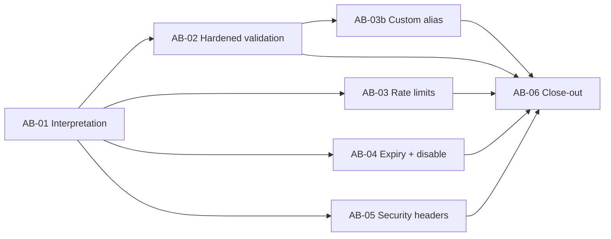

# Scenario 3: Ambiguous request, "make it safe from abuse" (v0.3.0)

The request comes with no detail: *"Make it safe from abuse."* Before writing code, I turn it into concrete threats,
decide what to build now and what to defer, and write down the questions I would ask product and security.

## 1. Why this is ambiguous
"Abuse" depends on **who abuses** and **who gets hurt**. A URL shortener can be abused by people creating links,
by people visiting links, or by people attacking the service itself, and the victims differ: visitors, link owners,
our reputation, or our infrastructure. Each reading leads to a different feature.

## 2. Interpretations (threat model)

| # | Abuse | Who is harmed | Example | Decision |
|---|---|---|---|---|
| 1 | **Disguising malicious targets** behind our domain | Visitors | Short link to a phishing page; our domain's reputation makes it look safe | Partly now (2–4), reputation checks deferred |
| 2 | **Redirecting into private networks** | Visitors' internal networks | `http://192.168.1.1/admin`, `http://localhost:8080` | **Build (AB-02)** |
| 3 | **Deceptive URLs** with credentials | Visitors | `https://paypal.com@evil.example/` actually goes to `evil.example` | **Build (AB-02)** |
| 4 | **Redirect loops / chaining** through ourselves | Service | Short link pointing at another of our short links | **Build (AB-02)** |
| 5 | **Mass creation** (spam, storage exhaustion) | Service, reputation | A script creating millions of links | **Build (AB-03)** |
| 6 | **Enumeration** (walking codes to find links) | Link owners' privacy | Trying codes on `/{code}` or `/api/links/{code}` | Random Base58 codes already; **rate limits (AB-03)** |
| 7 | **Impersonating or hijacking with custom aliases** | Visitors, service | `/paypal-login`, or an alias like `api` or `health` | **Build with the alias feature (AB-03b)** |
| 8 | **A bad link stays live forever** | Visitors | Reported phishing link keeps working | **Expiry + disable, 410 Gone (AB-04)** |
| 9 | **Attacks through our own pages** (XSS, clickjacking, MIME sniffing) | Visitors | Framing our page; sniffing a response as HTML | **Security headers (AB-05)**; CSP on the page exists since GF-05 |
| 10 | **Disabling other people's links** | Link owners | Without auth, a "disable" endpoint would let anyone take links down | **Admin key required (AB-04)** |
| 11 | Known-bad destinations (malware/phishing lists) | Visitors | Link to a domain on a blocklist | **Deferred:** needs an external reputation service |
| 12 | Inflating click stats with bots | Link owners | Scripted clicks | **Deferred:** needs a product decision and a reliable signal |
| 13 | Network-level floods (DDoS) | Service | Traffic beyond what the app can handle | **Out of scope:** infrastructure (WAF/CDN), not app code |

## 3. Chosen scope and why
I build the controls that **(a)** the app can enforce on its own with no external services (NFR-6), **(b)** protect
visitors first, since they are the people who can't protect themselves, and **(c)** are cheap to get right and test:

| Task | Control |
|---|---|
| AB-02 | Hardened target validation: no credentials in URLs, no private/loopback/link-local addresses (in any IP notation), no internal host names, no links to ourselves, optional domain denylist |
| AB-03 | Per-client rate limits: strict on creating links, looser on redirects and lookups; 429 with `Retry-After` |
| AB-03b | Custom aliases with rules: format, reserved words, impersonation blocklist, 409 on conflict |
| AB-04 | Expiry (`expiresAt`) and disable, both returning **410 Gone**; disabling requires an admin key; redirect cache respects both |
| AB-05 | Site-wide security headers |

## 4. Deferred, with reasons
| Deferred | Why | What it would take |
|---|---|---|
| User accounts / API keys for creators | Biggest gap, but a product-wide change | Identity provider, ownership of links |
| URL reputation checks (Google Safe Browsing / Web Risk) | External service, API key, cost, latency | Check at creation + periodic re-check |
| CAPTCHA on the web page | UX cost; rate limits first | Add if rate limits prove insufficient |
| Abuse reporting + admin UI | Needs a review workflow and owners | Report endpoint, moderation queue |
| Bot filtering in analytics | Needs a product decision | User-agent and behaviour signals |
| DNS-based checks (host name resolving to a private IP) | We never fetch the target, so there is no server-side request forgery risk; resolving every host adds latency and still races (DNS rebinding) | Re-evaluate if we ever fetch targets (e.g. previews) |

## 5. Questions I would ask before production
1. **Product:** Who may create links: anyone, or only signed-in users? That decides how much of this is needed.
2. **Product:** Should links expire by default? After how long?
3. **Security:** Which reputation service is approved, and do we block or warn on a hit?
4. **Security:** Who may disable links, and must a disabled link be restorable?
5. **Ops:** What rate limits match real usage? (Mine are guesses, in configuration so they can change without a deploy.)
6. **Ops:** Is the app behind a proxy or load balancer? Then the client IP comes from `X-Forwarded-For`, which must
   only be trusted from known proxies.
7. **Legal:** How long may click data be kept?

## 6. Decision record
[ADR-0004: Abuse controls](../adr/0004-abuse-controls.md).

## 7. Task decomposition

| Task | Requirements | Spec | Sign-off (at scenario review) |
|---|---|---|---|
| AB-01 | FR-6–FR-9, NFR-3 | none (this document) | none |
| AB-02 | FR-6, NFR-3 | [AB-02](../prompts/AB-02-hardened-validation.md) | security rules |
| AB-03 | FR-7, NFR-3 | [AB-03](../prompts/AB-03-rate-limiting.md) | rate-limit thresholds |
| AB-03b | FR-8, FR-4, NFR-3 | [AB-03b](../prompts/AB-03b-custom-alias.md) | API contract, schema, alias rules |
| AB-04 | FR-9, FR-4 | [AB-04](../prompts/AB-04-expiry-and-disable.md) | API contract, schema, admin key |
| AB-05 | NFR-3 | none | security headers |
| AB-06 | NFR-5 | none | none |

## 8. Execution
*Filled in as the work happens.*

## 9. Validation
*Filled in at close-out (AB-06).*
